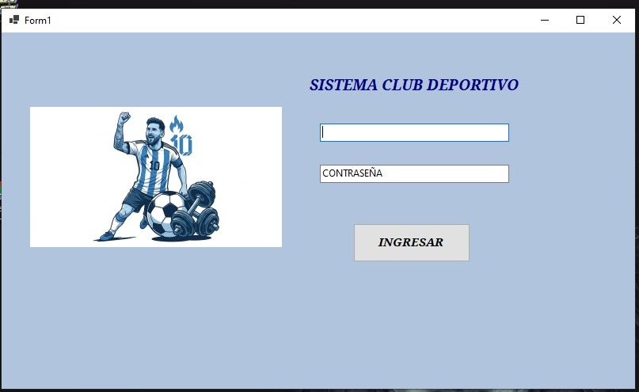
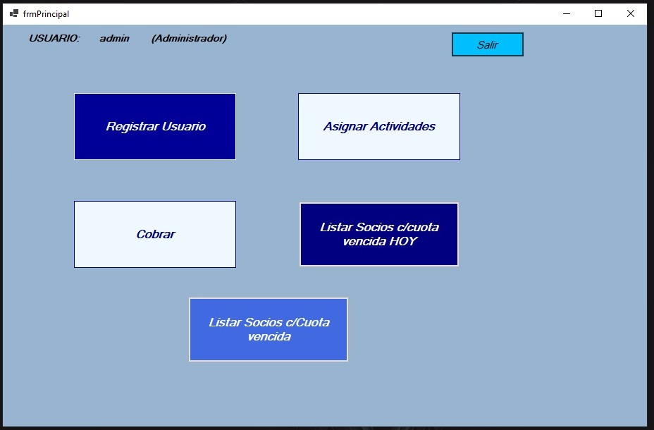
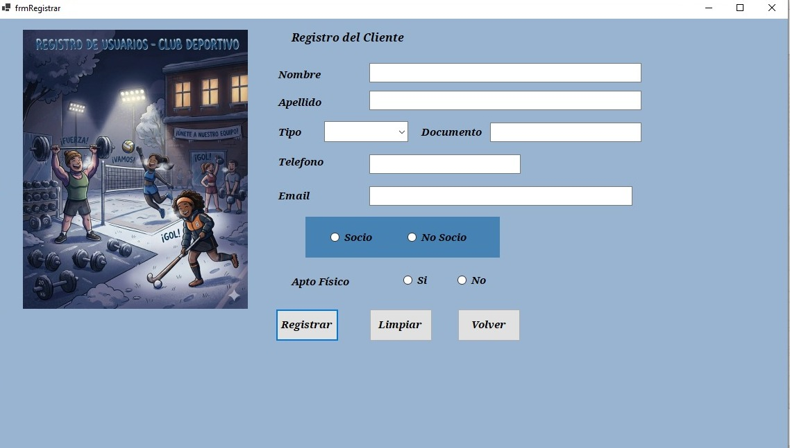
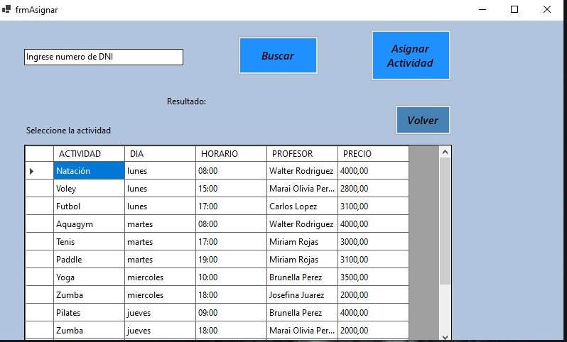
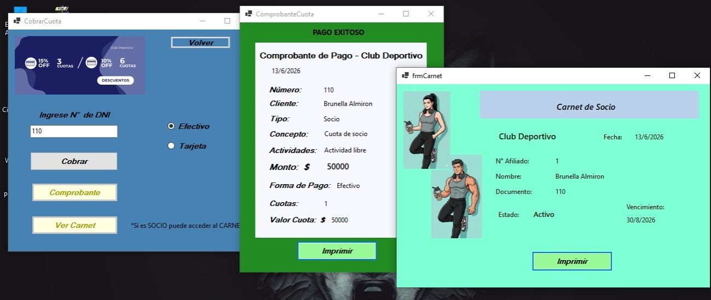
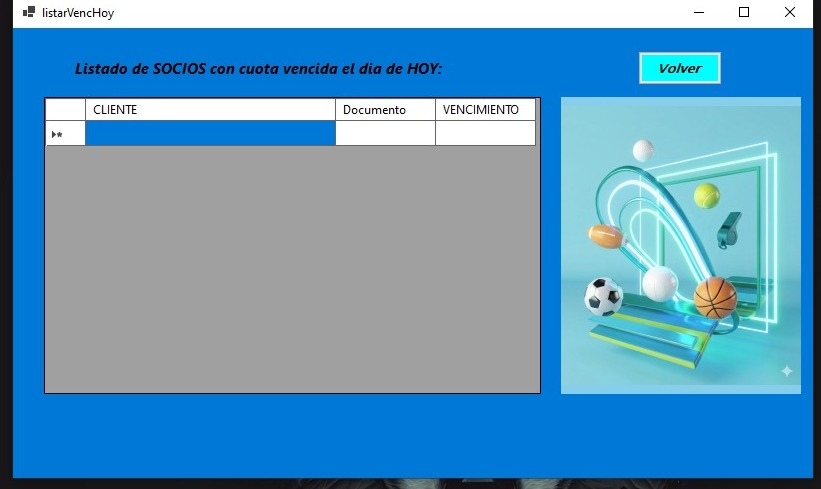
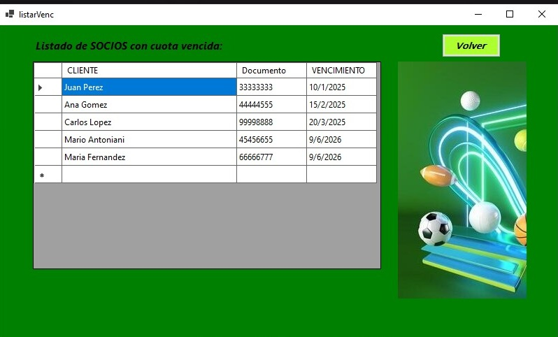

# 🏟️ Sistema Club Deportivo

> **Trabajo Práctico Integrador de POO** - Aplicación de gestión integral para clubes deportivos desarrollada en C#

## 📋 Descripción del Proyecto

Sistema de administración para clubes deportivos que permite gestionar socios, actividades, pagos de cuotas y acceso a información de afiliados. La aplicación implementa principios de Programación Orientada a Objetos (POO) en C# con acceso a base de datos.

## ✨ Características Principales

### 🔐 Autenticación

* Login de administrador con validación de credenciales.

### 👥 Gestión de Socios

* Registrar nuevos socios y no socios.
* Consultar socios con cuota vencida.
* Visualizar carnet de socio.
* Administrar estado y vencimiento de cuotas.

### 💰 Gestión de Cuotas y Pagos

* Registro de pagos.
* Generación de comprobantes.
* Selección de forma de pago.
* Cálculo automático de cuotas.

### 🎯 Actividades

* Asignación de actividades a socios.
* Gestión de participación y descuentos.

## 🛠️ Tecnologías Utilizadas

* **Lenguaje:** C#
* **Framework:** .NET
* **Interfaz:** Windows Forms
* **Base de Datos:** SQL Server
* **Paradigma:** Programación Orientada a Objetos (POO)

## 📊 Estructura de la Aplicación

```text
SISTEMA CLUB DEPORTIVO
├── 🔐 Login Administrador
└── 📱 Panel Principal
    ├── 👤 Registrar Usuario
    ├── 🎯 Asignar Actividades
    ├── 💰 Cobrar
    ├── 📋 Listar Socios con Cuota Vencida Hoy
    └── 📋 Listar Socios con Cuota Vencida
```

## 🎨 Funcionalidades

* Registro de clientes.
* Asignación de actividades.
* Cobro de cuotas.
* Emisión de comprobantes.
* Consulta de cuotas vencidas.
* Visualización de carnet de socio.

## 💡 Conceptos POO Implementados

* Encapsulación.
* Herencia.
* Polimorfismo.
* Abstracción.
* Composición.

## 🚀 Cómo Ejecutar el Proyecto

1. Clonar el repositorio.
2. Abrir la solución en Visual Studio.
3. Configurar la conexión a la base de datos.
4. Ejecutar la aplicación.

## 📸 Capturas de Pantalla

### Pantalla de Login



### Panel Principal



### Registro de Clientes



### Asignación de Actividades



### Cobro de Cuotas, comprobante y carnet de socio



### Listas de socios con cuota vencida





## 👩‍💻 Autora

**Griselda Soledad Perez, Laime Micaela, Paez Brian, Lamas Alejandro**

## 📄 Licencia

Proyecto académico con fines educativos.

---

**Estado:** ✅ Finalizado

